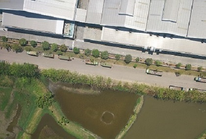

# C++

## Convert Color Image
[File](BlackWhite.cpp)

## Coin Recognition
[File](ComponentLabeling.cpp)

## Merge Two Images like Panorama
[File](ImageRegistration.cpp)
### Image Data

### Image Result

## Speed Counting of an Object
[File](Speedometer.cpp)

## Counting of Human and Motorcycle
[File](VehicleCounter.cpp)

